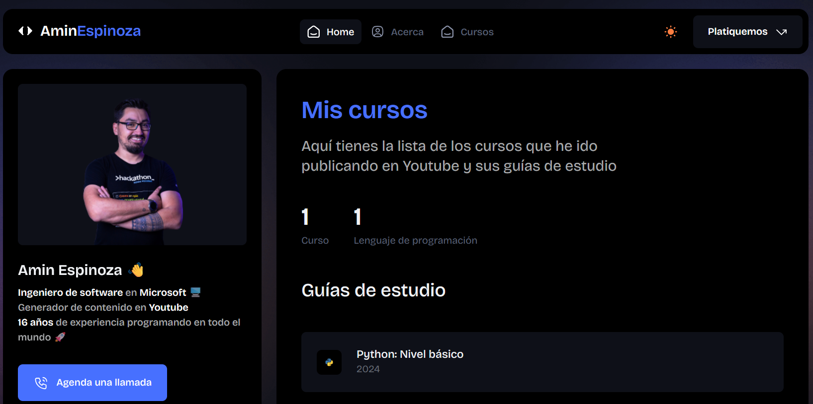
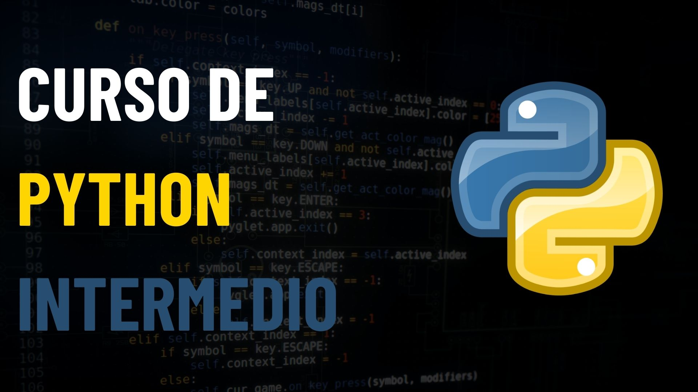

# Curso de Python

En este repositorio tendras acceso a todos los ejercicios de cada nivel del curso de Python.

Cada nivel cuenta con una hoja de referencia que te permite dar un mejor seguimiento a cada uno de los cursos. Puedes consultar las hojas de referencia en mi sitio web.

## Nivel principiante

Puedes ver el video del curso para este nivel aquí.

Aquí están todas las secciones del curso.

|Sección|Título|
|-------|------|
|1|[Variables](./Basico/Variables/)|
|2|[Operaciones y tipos de datos](./Basico/Operaciones/)|
|3|[Manejo de cadenas](./Basico/Cadenas/)|
|4|[Condiciones](./Basico/Condiciones/)|
|5|[Ciclos](./Basico/Ciclos/)|

## Nivel intermedio

Puedes ver el video del curso para este nivel aquí.

Aquí están todas las secciones del curso.

|Sección|Título|
|-------|------|
|1|[Formato de cadenas](./Intermedio/FormatoCadenas/)|
|2|[Métodos](./Intermedio/Metodos/)|
|3|[Bibliotecas](./Intermedio/Bibliotecas/)|
|4|[Variables de ambiente](./Intermedio/VariablesAmbiente/)|
|5|[Excepciones](./Intermedio/Excepciones/)|
|6|[Uso de JSON](./Intermedio/JSON/)|
|7|[Iteradores](./Intermedio/Iteradores/)|

## Nivel avanzado

## Especialidades
